# 🎫 Ticket Full Stack App

A full-stack event ticketing platform built using **Spring Boot** (backend) and **React + Vite + TypeScript** (frontend).

---

## 🚀 Tech Stack

- **Frontend:** React, Vite, TypeScript, TailwindCSS
- **Backend:** Spring Boot, REST APIs
- **Database:** PostgreSQL (via Docker)
- **Authentication:** Keycloak (OpenID Connect)
- **Deployment:** GitHub + Render

---

## 📸 Screenshots

### 🏠 Home Page
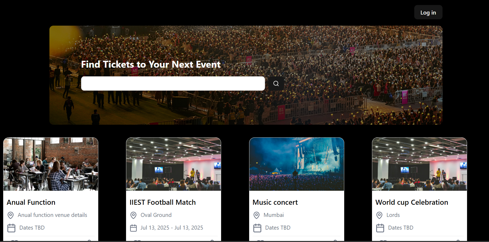

### 🔐 Login Page
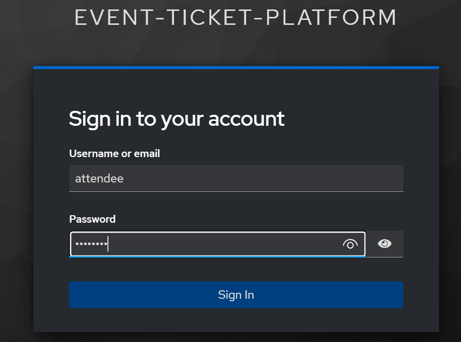

### ✅ Logged In View
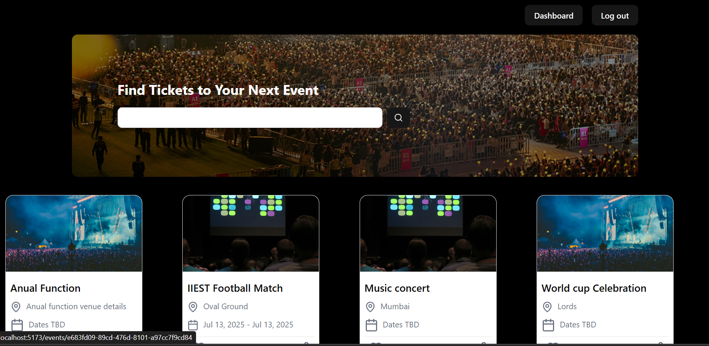

### 📅 Create Event
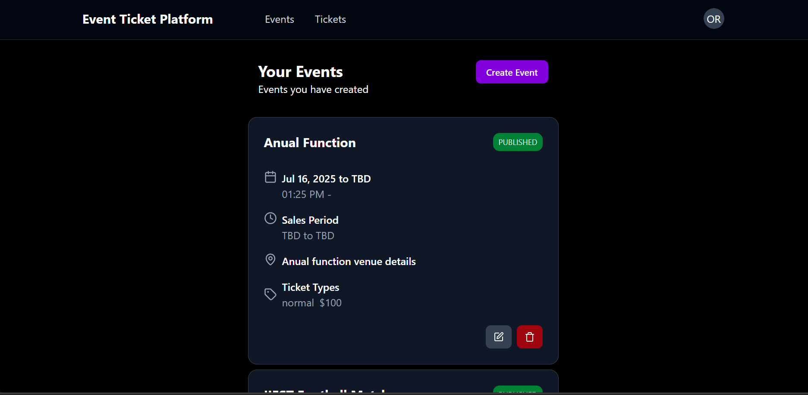

### 📦 Ticket View
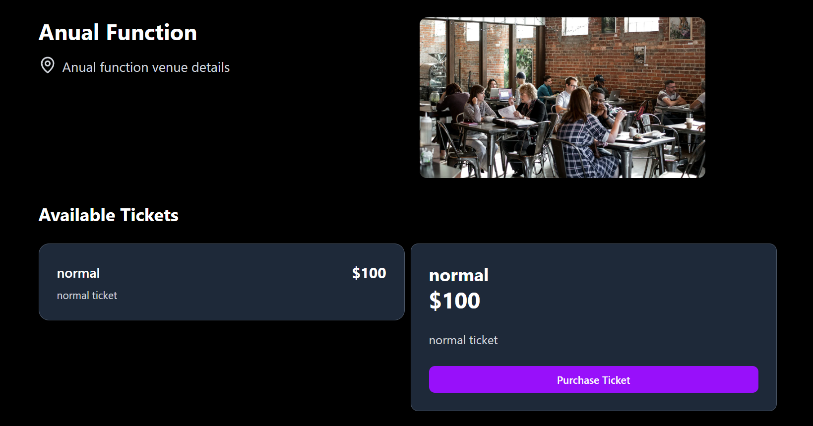

### 👥 Organizer Login
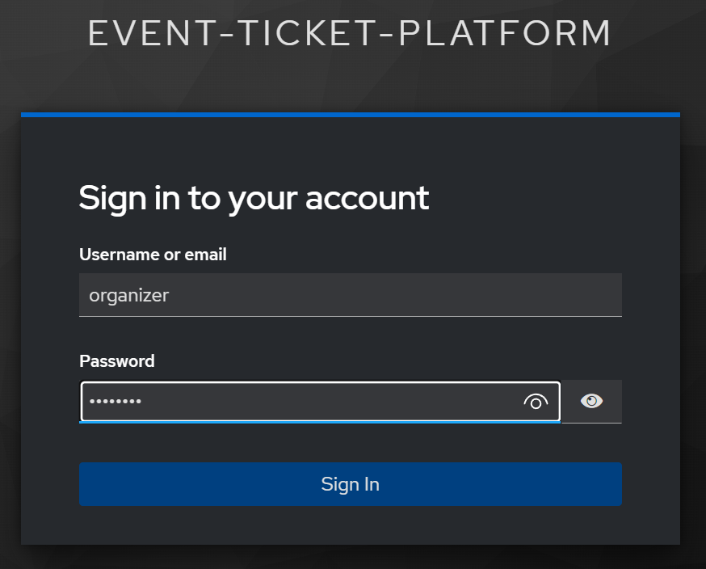

### 👤 Staff Login
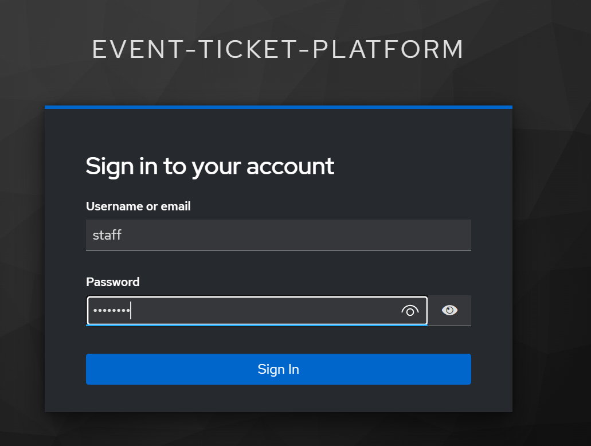

### 🧑‍💼 Staff Dashboard
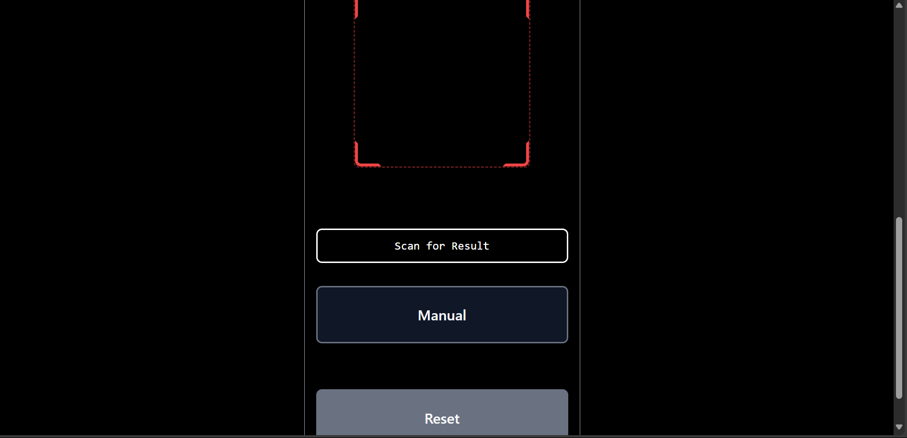

### 🙋 Attendee Dashboard
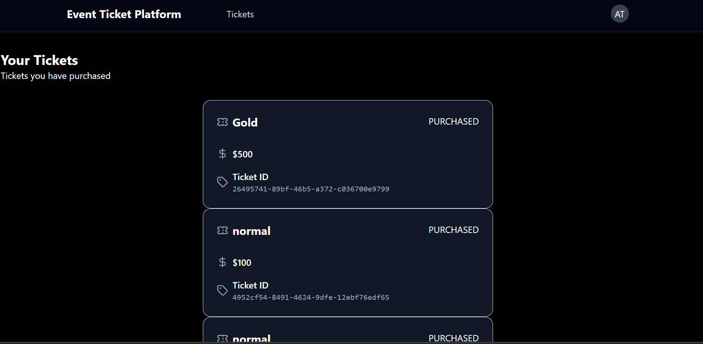

### 💳 Payment Page
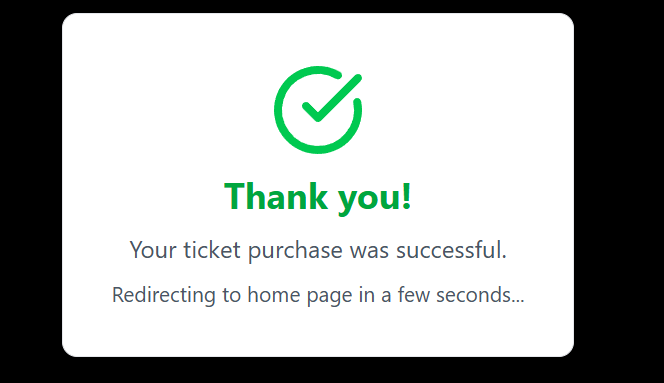

### ✅ Event Created
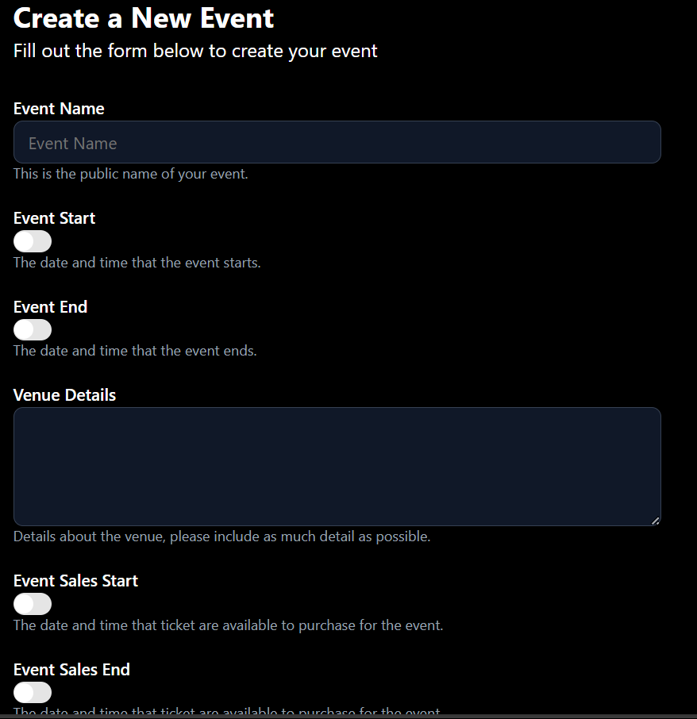

---

## 📦 Project Structure

Ticket_Full_Stack/
├── backend/ → Spring Boot API
├── frontend/ → React Vite frontend
├── assets/ → Screenshots used in README
└── .gitignore

## 🧪 How to Run Locally

## ▶ Backend

bash
cd backend
./mvnw spring-boot:run
Runs on http://localhost:8080

💻 Frontend

bash
Copy
Edit
cd frontend
npm install
npm run dev
Runs on http://localhost:5173

🙌 Author
Ravindra Bijarniya
GitHub: @Ravindrabijarniya

⭐ Show Your Support
If you like this project, please ⭐️ it on GitHub!

